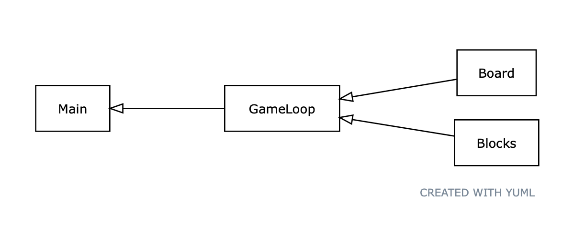
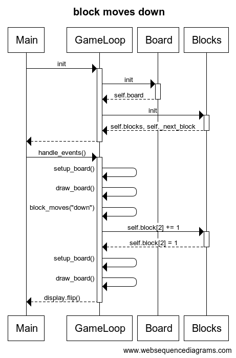

# Arkkitehtuurikuvaus

## Rakenne

Koodin pakkausrakenne on seuraava:

Pakkaus Block sisältää tetrispalikoiden alustukse ja pakkaus Board pelialustan luomisen. GameLoop:ssa on pelin toimintojen funktiot ja Main:ssa toteutetaan pelin käynnistäminen ja pelaaminen.

## Päätoiminnallisuudet

Tetrispalikan liikkuminen alaspäin sekvenssikaaviona:

## Sovelluslogiikka

Sovelluksen loogisen tietomallin muodostavat luokat Board ja Blocks, jotka kuvaavat palikoiden ja pelualustan rakennetta.
 
Sovelluksen toiminnallisuuden perustavat luokat GameLoop ja Main.
Gameloopissa on metodeja esimerkiksi:
- `draw_board()`
- `block_moves(direction)`
- `block_rotate()`

jotka vastaavat siis pelin kulun aikana tapahtuvien tapahtumine seurauksista gameloopin `handle_events()` metodin sisällä

Mainin metodissa `play()` ensin suoritetaan pygame.init(), luodaan display ja startataan GameLoop. Kutsutaan gamelooppin `handle_events()` metodia, joka valvoo pelin tapahtumia ja toimii niiden mukaan.

## Tietojen pysyväistallennus

Ohjelma tallentaa pelaajien huippupisteitä kansioon `score.txt`
